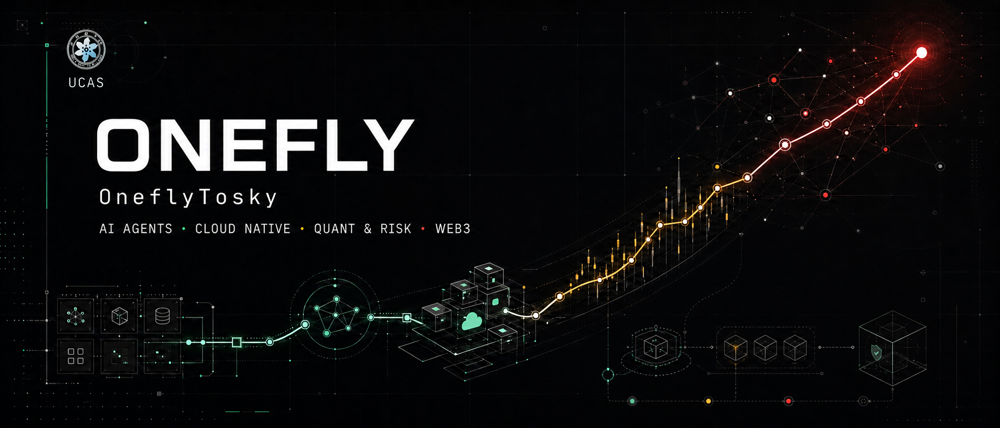

[Blog](https://onefly.top) · [Google Scholar](https://scholar.google.com.hk/citations?user=4QSzqZoAAAAJ) · [LinkedIn](https://www.linkedin.com/in/ranxi/)

## Hey 👋, I'm Onefly. Nice to see you

## Why "Onefly"?

> **Onefly = Focus on one meaningful problem, then make it fly.**

我把 `Onefly` 理解为 `one + fly`：`One` 代表保持独立判断，也代表一次专注一个值得解决的问题；`Fly` 代表把想法真正做成能运行、能验证、能帮助人的系统。中文里，它也延续了我「孤飞」的署名：独立思考，持续前行，也通过开源让独行不再孤单。同时，中文有一个成语叫「一飞冲天」，我将它翻译为 **OneflyTosky**。

## What I'm Working On

- **Agent 工程与基础设施**：Agent loop、工具编排、上下文与记忆、沙箱生命周期，以及生产级可靠性。
- **云原生开源**：围绕 Go / Kubernetes 参与 AgentCube、Karmada 等上游项目。
- **量化与风险工程**：面向 Web3 市场构建 Agent 驱动的研究流水线、异常检测与自动化风控。
